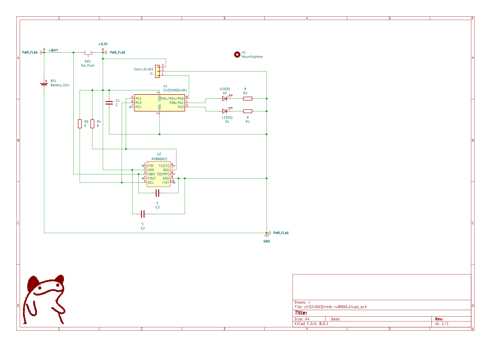
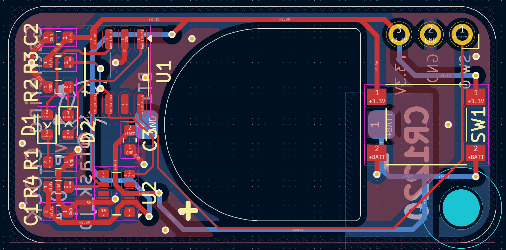
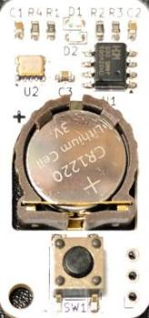
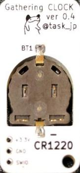

# Gathering CLOCK

Simple two LEDs clock that tells first 5mins in hours.

## Features

|Min  |Green|Red  |
|-----|-----|-----|
|00-05|On   |     |
|05-10|     |Blink|
|10-55|     |On   |
|55-60|Blink|     |

* pushing a button for over 30 secs resets the clock

## Schematic and Layout

## Bill Of Materials

|Ref     |Name          |Qty|Description     |Link                                        |
|--------|--------------|  -|----------------|--------------------------------------------|
|U1      |CH32V003J4M6  |  1|Micro Controller|https://akizukidenshi.com/catalog/g/g118062/|
|U2      |RX8900CE      |  1|RTC             |https://akizukidenshi.com/catalog/g/g113320/|
|BT1     |Battery holder|  1|CR1220          |https://akizukidenshi.com/catalog/g/g109561/|
|D1      |LED           |  1|Green           |https://akizukidenshi.com/catalog/g/g106417/|
|D2      |LED           |  1|Red             |https://akizukidenshi.com/catalog/g/g103978/|
|C1,C2,C3|Capacitor     |  3|0.1uF           |https://akizukidenshi.com/catalog/g/g113374/|
|R1,R2   |Resistor 200  |  2|LED limit       |https://akizukidenshi.com/catalog/g/g106201/|
|R3,R4   |Resistor 3K3  |  2|Pull up         |https://akizukidenshi.com/catalog/g/g114661/|
|SW1     |Push Switch   |  1|                |https://akizukidenshi.com/catalog/g/g115969/|

## Case

- [Fusion f3d file](./fusion/ch32v003j4m6-rx8900.f3d)
- STL
  - [Front](fusion/ch32v003j4m6-case-front.stl)
  - [Back](fusion/ch32v003j4m6-case-back.stl)

## License
* MIT

## Author
* stasuku@gmail.com
